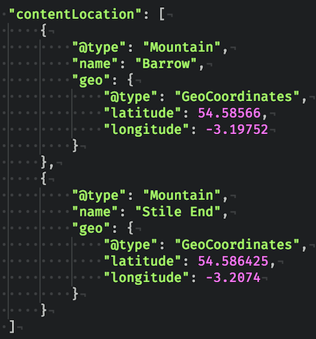

title: "Schema.org : Structured data FTW"
author:
  name: Lee Willis
  twitter: leewillis77
  url: https://www.ademti-software.co.uk
style: schema.css
output: schema.html

--
# Schema.org
## Structured data FTW!
&nbsp;  
## @leewillis77
##[www.ademti-software.co.uk](https://www.ademti-software.co.uk)
##[plugins.leewillis.co.uk](https://plugins.leewillis.co.uk)

--
### Before we start &hellip;
* This is an SEO-related talk *but* I am not an SEO "expert"
* I am a backend developer *but* this is not a "dev" talk
* It's not WordPress-specific &hellip;

--
### What is schema.org ?

* Shared guidelines for semantic markup
* How to mark-up / tag certain content
* HTML doesn't give enough context

--
* We have
    * <code>&lt;nav&gt;</code>
    * <code>&lt;article&gt;</code>
    * <code>&lt;section&gt;</code>
    * &hellip;

--
*  but no
    * <code>&lt;product&gt;</code>
    * <code>&lt;event&gt;</code>
    * <code>&lt;rating&gt;</code>

--
# So what ?

--
* Semantic markup helps search engines **understand**
* Can do smarter stuff with it

--
# Why should *you* care ?

--
* Used by Google to enhance search results
* Better listing
    * richer information for users
    * increased clickthroughs
* Better understanding of relevance
    * better ranking?

--
# Better listings ?

--
# Before

--  
# Products & reviews

--

# Events

--

# Recipes

--

* 583 data types defined at schema.org
* Some examples
    * CreativeWork <small class="sublist">(Article, Book, Movie, Episode)</small>
    * Event <small class="sublist">(BusinessEvent, ComedyEvent, Festival)</small>
    * Organization
    * Place <small class="sublist">(Accommodation, Museum, Mountain & Volcano!)</small>

--
# <small>No idea if they'll do anything interesting</small>
--

# Let's take a look &hellip;

--

* Confusingly, 3 different ways to do it
    * JSON-LD*
    * Microdata
    * RDF-a
* All just markup changes - nothing *difficult*

<small class="sublist">* Google's preferred option</small>

--

# A worked example
## https://myhillblog.co.uk/

--

--

--

## Basic markup

--

## Enrich it with more info

--

## Really go to <strike>town</strike> the hills

--

* https://wordpress.org/plugins/wp-structuring-markup/
* https://wordpress.org/plugins/schema/

--
# Go forth, and mark up your metadata
