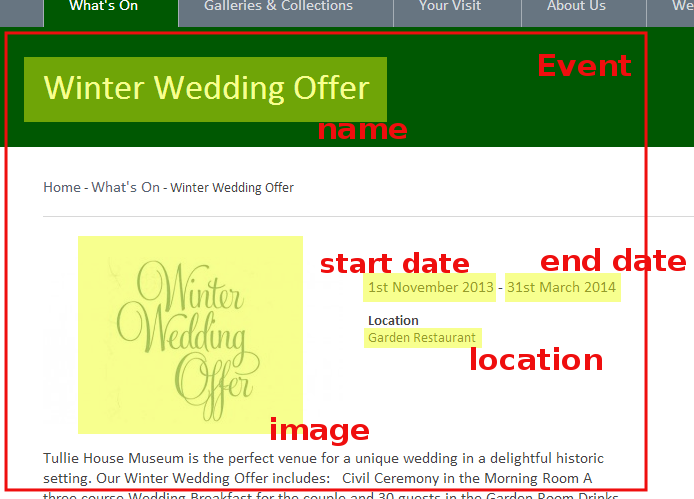
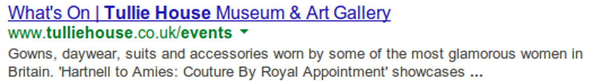
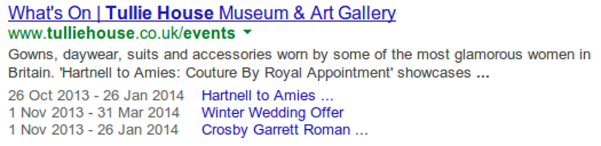
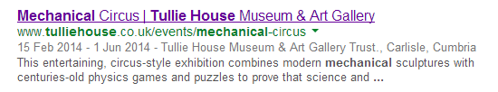

# Schema.org

!SLIDE title

## Structured data FTW!

@leewillis77

!SLIDE

# What is schema.org?

* Shared (open) guidelines by "the search engines"
* (including Google)

!SLIDE 

# What is schema.org?

* Guidelines for semantic markup
* Semantic in the real-world sense

!SLIDE
# HTML
## "This is a paragraph"
## &nbsp;

!SLIDE
# HTML + schema.org markup
## "This is a paragraph
## **and** it is a product description"

!SLIDE

# So why bother?

!SLIDE

* Allows search engines to **understand** content better

!SLIDE

* Used by Google (and Bing) to **enhance** search engine results

!SLIDE

## Better listing
<i class="fa fa-arrow-circle-down" aria-hidden="true"></i>
## More information for users
<i class="fa fa-arrow-circle-down" aria-hidden="true"></i>
## More clickthroughs

!SLIDE

* Better understanding of relevance » Better ranking?

!SLIDE

### Before

!SLIDE 
### After

!SLIDE

# Enhanced SERP listings for
* Breadcrumb navigation
* Products
* Reviews
* Events
* People
* Recipes

!SLIDE

* Many other types defined at schema.org
* Not clear if/when they'll do anything interesting

!SLIDE

# The good part?

!SLIDE

* It's a "zero-cost" feature if you build it in by default
* Just simple changes to the markup

!SLIDE

# A worked example
[http://www.tulliehouse.co.uk/events/winter-wedding-offer](http://www.tulliehouse.co.uk/events/winter-wedding-offer)

!SLIDE

## Data to be marked up

!SLIDE

## Mapped to schema.org

!SLIDE

## Normal markup

!SLIDE

## The task

* Wrap entities (Event, Place, Postal Address)
* &lt;div itemscope itemtype="http://schema.org/Event"&gt;

!SLIDE

* Wrap properties
* &lt;h1 itemprop="name"&gt; 

!SLIDE
* Add a (Hidden) address 

!SLIDE
* Entities can be nested
* Event &raquo; Place &raquo; Postal address
* Sub-entities can occur more than once per-item
* Entities can occur more than once per page

!SLIDE
## From this

!SLIDE
## To this

!SLIDE
## From this

!SLIDE
## To this

!SLIDE
## And this

!SLIDE
# Go forth, and
# mark up your metadata
## [http://schema.org](http://schema.org)

https://developers.google.com/search/docs/guides/search-gallery