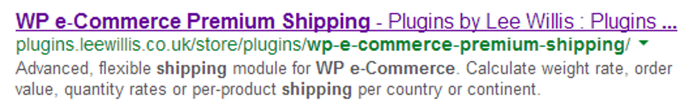
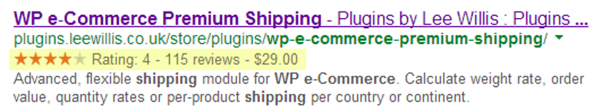

# Schema.org

!SLIDE title

# Schema.org
## Rich snippets FTW!

!SLIDE

# What is schema.org?

!SLIDE

* A set of semantic markup guidelines
* Markup conventions
* Shared guidelines by "the search engines"
    * Including Google

!SLIDE

# Why bother?

!SLIDE

* Allows search engines to understand content better
* Used by Google to enhance search engine results

!SLIDE

# So what?

!SLIDE

* Increased clickthroughs - "better" listing / more info for users
* Better understanding of relevance &raquo; better ranking?

!SLIDE




!SLIDE

* Google claim enhanced listings for:
    * Products
    * Reviews
    * Events
    * Breadcrumb navigation
    * People
    * Recipes
* Many other types defined at schema.org

!SLIDE

# The good part?

!SLIDE

* It's a "zero"-cost feature if you build it in by default
* Just simple changes to the markup

!SLIDE

# A worked example
[http://www.tulliehouse.co.uk/events/winter-wedding-offer](http://www.tulliehouse.co.uk/events/winter-wedding-offer)

!SLIDE

}}} images/tullie-page.png

!SLIDE

}}} images/tullie-page-markedup.png

!SLIDE

``` html
<div id="feature-heading">
  <h1 itemprop="name">Winter Wedding Offer</h1>
</div>
<div id="content" class="span8 col">
  <div class="block block-system odd" id="block-system-main">
	<div id="node-2360" class="node node-event">
	  
	  <p class="date"><strong>Date:</strong><br /><span itemprop="startDate" content="2013-11-01">1st November 2013</span> - <span itemprop="endDate" content="2014-03-31">31st March 2014</span></p>
	  <div class="location field" itemprop="location" itemscope itemtype="http://schema.org/Place">
	    Garden Restaurant
	    <div class="hidden" itemprop="name">Tullie House Museum &amp; Art Gallery Trust.</div>
	    <div class="hidden" itemprop="address" itemscope itemtype="http://schema.org/PostalAddress">
	      <span itemprop="streetAddress">Castle Street</span>,<br />
	      <span itemprop="addressLocality">Carlisle</span>,<br />
	      <span itemprop="addressRegion">Cumbria</span>,<br />
	      <span itemprop="postalCode">CA3 8TP</span>
	    </div>
	  </div>
	</div>
  </div>
</div>
```


!SLIDE

``` html
<div id="entity-wrapper" itemscope itemtype="http://schema.org/Event">
  <div id="feature-heading">
    <h1 itemprop="name">Winter Wedding Offer</h1>
  </div>
  <div id="content" class="span8 col">
 		<div class="block block-system odd" id="block-system-main">
      <div id="node-2360" class="node node-event">
        
        <p class="date"><strong>Date:</strong><br /><span itemprop="startDate" content="2013-11-01">1st November 2013</span> - <span itemprop="endDate" content="2014-03-31">31st March 2014</span></p>
        <div class="location field" itemprop="location" itemscope itemtype="http://schema.org/Place">
          Garden Restaurant
          <div class="hidden" itemprop="name">Tullie House Museum &amp; Art Gallery Trust.</div>
          <div class="hidden" itemprop="address" itemscope itemtype="http://schema.org/PostalAddress">
            <span itemprop="streetAddress">Castle Street</span>,<br />
            <span itemprop="addressLocality">Carlisle</span>,<br />
            <span itemprop="addressRegion">Cumbria</span>,<br />
            <span itemprop="postalCode">CA3 8TP</span>
          </div>
        </div>
      </div>
    </div>
  </div>
</div>
```


!SLIDE
# Thank you for listening
## Lee Willis - @leewillis77
### [github.com/leewillis77/26-things](https://github.com/leewillis77/26-things)